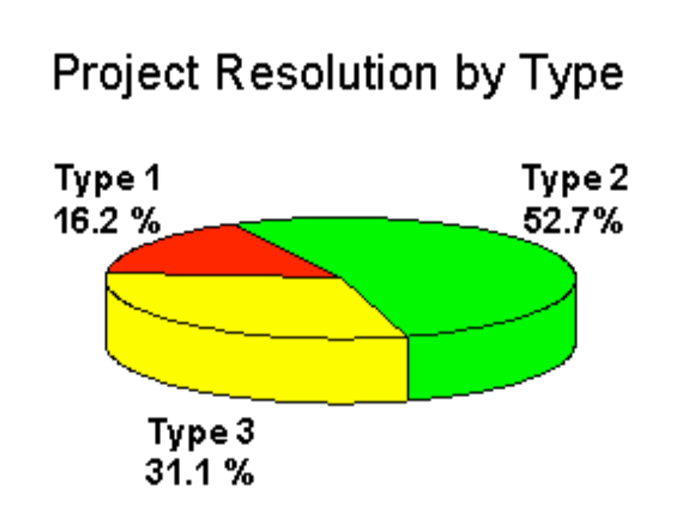

# Breve storia dello sviluppo software

In questo corso impareremo a sviluppare una applicazione web in HTML5.

Sviluppare una applicazione per il web può sembrare inizalmente semplice,
perché le tecnologie base usate (HTML5, browser) sono molto diffuse e abbastanza semplici da usare. Tuttavia, ci sono delle insidie nascoste: le applicazioni web oggi devono soddisfare le esigenze di un mondo che cambia velocemente, sia per quanto
riguarda il mercato, sia per le le tecnologie al contorno utilizzate, ad esempio i dispositivi, le librerie software usate, etc.

Per evitare problemi ricorrenti, nel corso del tempo sono si sono consolidate delle strategie di sviluppo che si sono dimostrate efficaci. Facciamo un rapido riepilogo storico per vedere come siamo arrivati alle metodologie che useremo in questo corso.

## Le origini: le fasi di un progetto ed il metodo Waterfall
Nel 1970, Winston W. Royce era direttore del Software Technology Center della Lockheed Martin ad Austin, in Texas. Fu un pioniere dello sviluppo software, e in un suo celebre articolo descrisse **le 5 fasi necessarie per la realizzazione di un prodotto software**:

1. Analisi dei requisiti
1. Design
1. Implementazione (coding)
1. Testing
1. Manutenzione

Questo flusso divenne in seguito noto come **waterfall**. Con il passare degli anni e la prova sul campo, si è visto che queste 5 fasi sono teoricamente corrette, ma capitava troppo spesso che imprevisti di vario genere facessero rallentare o fermare del tutto il progetto.

I problemi divennero evidenti quando una celebre statistica del 1994, chiamata [CHAOS Report](http://www.standishgroup.com/outline), mostrò come il **96%** dei progetti software analizzati non fossero stati completati   fase hanno statisticamente un'alta percentuale di fallimento.

<em>Fonte: CHAOS Report 1995</em>

- Type 1: progetti conclusi con le funzionalità previste, nel rispetto del budget e dei tempi di consegna
- Type 2: progetti conclusi ma con meno funzionalità di quelle previste, o non rispettando il budget o i tempi di consegna
- Type 3: progetti abortiti durante lo sviluppo

Era evidente ormai che serviva qualche modifica a modello waterfall.
