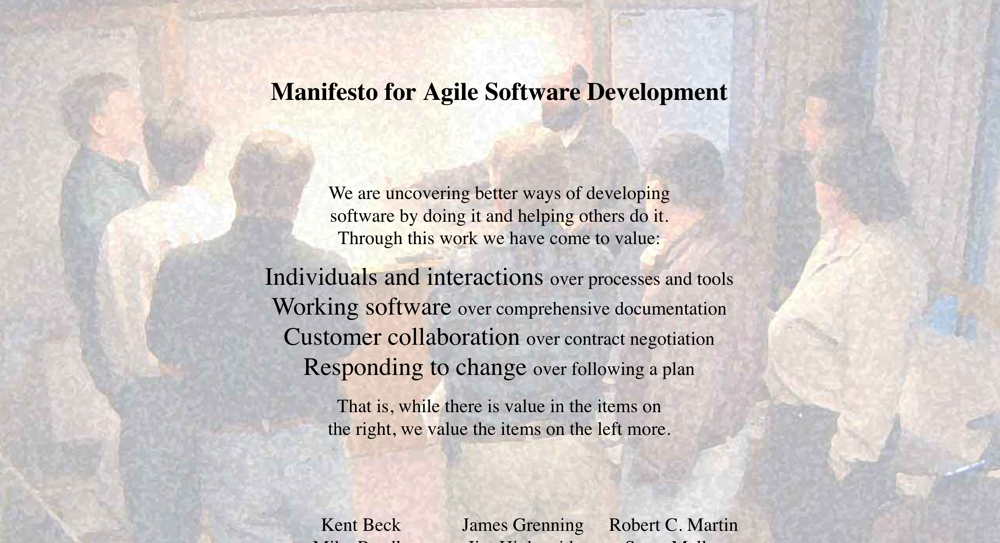

# Agile

Dopo il CHAOS Report del 1994, un gruppo di consulenti software si è messo al lavoro per ragionare su nuove metodologie di sviluppo. I problemi identificati alla base degli insuccessi nello sviluppo software riguardavano soprattutto l'impossibilità di elencare tutti i requisiti all'inizio del progetto e considerarli immutabili, e i rapporti interpersonali all'interno del team e verso l'esterno.

 Ci fu un incontro storico nella località sciistica di Snowbird, in Utah (USA) nel 2001, durante il quale pubblicarono il [manifesto Agile](http://agilemanifesto.org/), contenente i valori e principi che secondo loro dovevano essere alla base di un buon progetto software per avere le maggiori probabilità di riuscire.

 

 

 
 

 

 <em>www.agilemanifesto.org</em>
 

 

## I 4 valori Agile

Alla base delle metodologie Agile ci sono 4 valori fondamentali.

 
**Individuals and interactions** over processes and tools
 
 
**Working software** over comprehensive documentation
 
 
**Customer collaboration** over contract negotiation
 
 
**Responding to change** over following a plan
 
 

In ognuno dei valori, la parte a destra è importante, ma quella a sinistra è considerata più importante. Tutte le metodologie Agile si basano su questi valori, e compiono delle scelte significative di conseguenza.

### Individuals and interactions over processes and tools
Definire dei processi e degli strumenti aziendali è importante, ma non bisogna mai dimenticarsi che il software alla fine è sviluppato da persone che usano strumenti e processi, non dagli strumenti e processi da soli. Qualsiasi strumento usato male o controvoglia non può funzionare. Al contrario, un piccolo gruppo di persone può realizzare grandi risultati se c'è affiatamento e determinazione.

Sulla base di questo valore, quando qualcuno del team ha un problema ad usare uno strumento o a seguire un processo, bisogna cercare di favorire sempre la persona, e riadattare processi e strumenti di conseguenza.

### Working software over comprehensive documentation
Un prodotto software senza documentazione può essere difficile da mantenere, e questo è tristemente noto alla maggior parte degli utenti e sviluppatori. Tuttavia, un software che non funziona è impossibile da usare, con tutta la buona volontà, ed è quindi inutile. Nello sviluppo del prodotto quindi è preferibile concentrarsi maggiormente sul far funzionare il software rispetto a scrivere una documentazione perfetta e completa di qualcosa che non esiste.

Attenzione: quando qui parliamo di documentazione, intendiamo quella necessaria _allo sviluppo interno del progetto_, in altre parole quella interna all'azienda, e _non_ la documentazione per l'utente finale. La documentazione finale può essere considerata parte integrante del prodotto, e va quindi realizzata e completata come tutto il resto del software.

### Customer collaboration over contract negotiation
I contratti firmati sono necessari per partire con un lavoro e accordarsi sui punti fondamentali, ma non devono essere una scusa dietro cui nascondersi. Se c'è qualche imprevisto e qualcosa sta andando storto, meglio avvertire il cliente il prima possibile e renderlo partecipe dei problemi, cercando una possibile soluzione. In ogni caso, mai rendere noti i problemi a ridosso della consegna, o peggio ancora inventare scuse.

Questo punto, similmente al primo, mette al primo posto le persone rispetto agli strumenti e alle carte. In questo caso però l'attenzione è rivolta verso l'esterno del team e dell'azienda.

### Responding to change over following a plan
La capacità di seguire un piano prestabilito è una delle caratteristiche fondamentali che distinguono uno sviluppatore professionista. Tuttavia i requisti del cliente cambiano, così come le situazioni all'interno dell'azienda, e gli imprevisti capitano continuamente. Un framework Agile deve incorporare strutturalmente la capacità di reagire ai cambiamenti e agli imprevisti, minimizzando problemi e danni.

Attenzione però a non esagerare dal lato opposto: se i piani cambiano _troppo_ frequentemente, si arriva a quella che si può chiamare _pianificazione isterica_, in cui tutto cambia continuamente e non si arriva mai a destinazione. Un buon framework deve trovare il bilanciamento fra questi due aspetti.

## I framework Agile
Nella pratica, come facciamo a implementare questi valori?

Esistono varie proposte concrete, chiamate _metodologie_ o _framework_, che sono nate nel corso degli anni. Le più importanti sono:
- [Scrum[1990s]](https://it.wikipedia.org/wiki/Scrum_(informatica)): uno dei primi framework, nato già prima della pubblicazione del manifesto; definisce piccoli team (dalle 5 alle 9 persone), cicli iterazione brevi (dalle 2 alle 4 settimane), e una chiara definizione dei ruoli.
- [eXtreme Programming [1996]](http://www.extremeprogramming.org): molto orientato ai programmatori, si concetra sulla negoziazione continua tra sviluppatore e cliente, ha cicli di iterazione brevissimi (1 giorno), si basa sul [pair programming](https://it.wikipedia.org/wiki/Pair_programming) e sul [Test Driven Development](https://it.wikipedia.org/wiki/Test_driven_development)
- [Lean [2003]](https://it.wikipedia.org/wiki/Lean_software_development): è la trasposizione per lo sviluppo SW del Lean Manufacturing di Toyota, si focalizza sull’eliminazione dello spreco (waste) e cerca di ritardare le decisioni il più possibile

In questo corso noi approfondiremo il framework Scrum.
